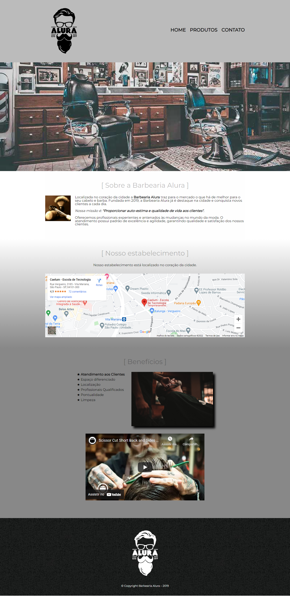

# barbearia

Projeto criado durante as quatro partes do curso de HTML5 e CSS3 da Alura, dentro da [formaçao Front-end](https://cursos.alura.com.br/formacao-front-end).

Você pode ver o resultado final [aqui](https://jessicalorenzon.github.io/barbearia).

